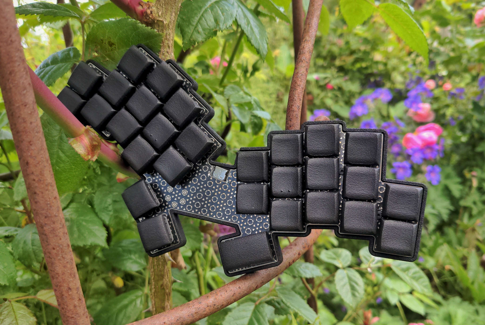
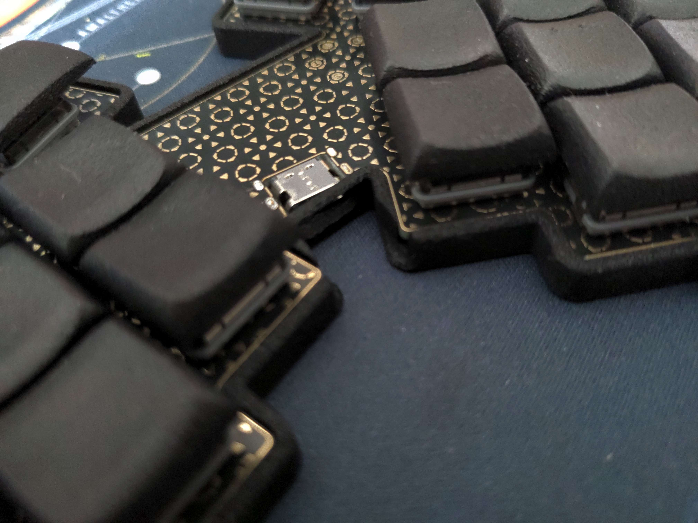

### fitis

29 key unibody keyboard with asymetric thumbs

## features

- Hotswap sockets (Choc V1)
- CH552T Controller (w/ FAK firmware)
- gerber and case files are supplied (kicad files, stl as well as cadquery files)
- completely open source, permissive license ([CERN-OHL-P](https://cern-ohl.web.cern.ch/home))

## want one?

All production files you need to build your own board can be found [here](./prod/).

The pcb pictured above was done with ENIG finish. If you don't want to pay that, you may eitheruse HASL (silver, but a bit rougher), or use the gerbers where the copper is not exposed.

Apart from the pcb and optionally a case you need:

- 29 hotswap sockets

- 29 diodes (1N4148 int SOT-123)

- 29 of your favourite choc switches

- 1x CH552T (TSSOP-20)

- 1x USBLC6-2SC6 (SOT-23-6)

- 4x 0 Ohm resistors (SMD 0603)

- 1x 10kOhm resistor (SMD 0603)

- 2x 5.1kOhm resistors (SMD 0603)

- 2x 100nF capacitors (SMD 0603)

- 1x USB Connector C-Type, 12 pin/16pin, mid-mount (1.6mm)

If you want to use the case, you might have to look for a fitting usb cable. The connector has to be relatively thin to fit.

### firmware

Config for FAK can be found [here](https://github.com/weteor/fak-config/tree/main/keyboards/fitis). Please also see [FAK-Firmware site](https://github.com/semickolon/fak) for more information

Bootloader should be available on plugin until firmware is written. After that either use the firmware BOOT to go into bootloader, or hold the boot button (right one on the bottom) on the pcb pressed while pluggin in the usb cable.

### the rest

Everything in this repository is free to use however you might see fit. If you want to support me and my projects, please consider linking back to this repository if you build/change/use anything.

If you would like to send me a tip, you could do it [here](https://ko-fi.com/weteor) (Please don't feel like you have to).

### special thanks
The two bird species, Fitis and Zilpzalp, are very difficult to tell apart visually. As a rule, however, Fitis have light, orange-colored legs, while those of the Zilpzalp are dark

So, yeah, thanks to Apfel for making me aware of Aptmak and for the zilpzalp keyboard, which (heavily?) inspired the Fitis. You can find more cool stuff [in his repo](https://github.com/kilipan)

### more pictures

